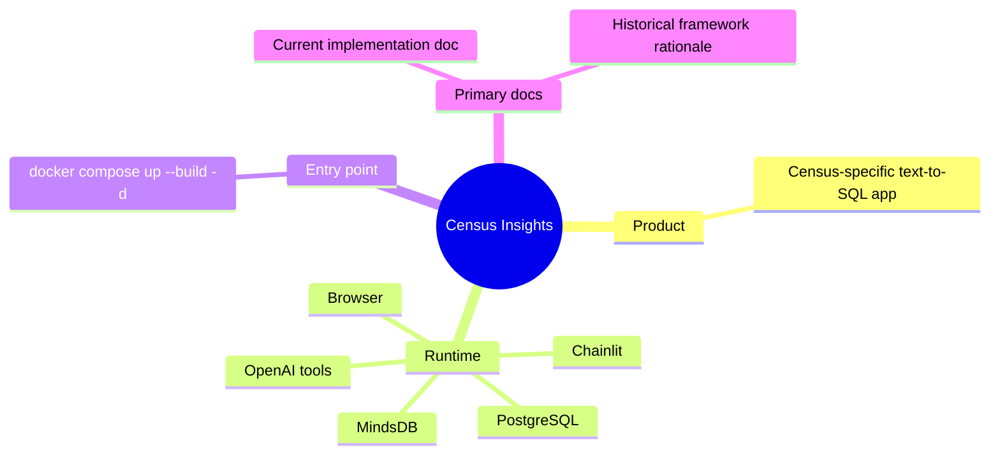
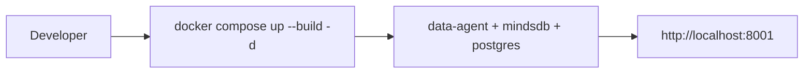
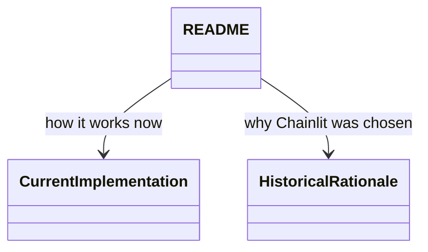
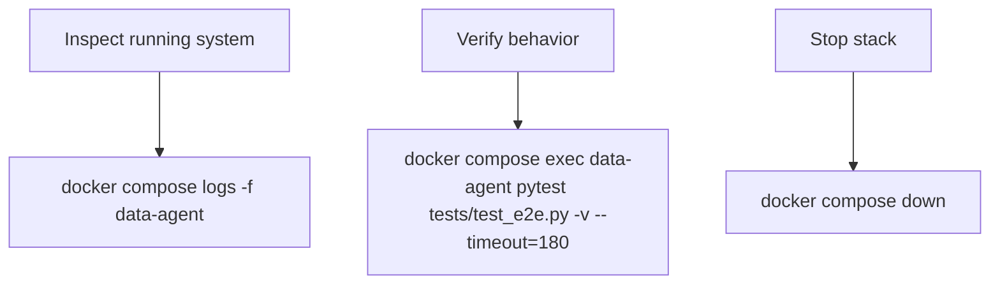

# Census Insights



This README stays intentionally small so the first thing a reader sees is the runtime shape, not a wall of setup prose.

## Start



This path is short because the repo is designed to come up as one local stack rather than through a manual multi-step bootstrap.

```bash
docker compose up --build -d
```

## Key docs



These links are separated so maintainers can jump directly to either runtime truth or historical context without mixing the two.

- Current implementation: `docs/analysis/2026-03-07-current-implementation-design.md`
- Historical framework rationale: `docs/analysis/2026-02-05-chainlit-vs-streamlit-comparison.md`

## Useful commands



These commands cover the three most common operational needs: inspect, verify, and stop.

```bash
# logs
docker compose logs -f data-agent

# run e2e tests
docker compose exec data-agent pytest tests/test_e2e.py -v --timeout=180

# stop stack
docker compose down
```
