# Current Implementation Design

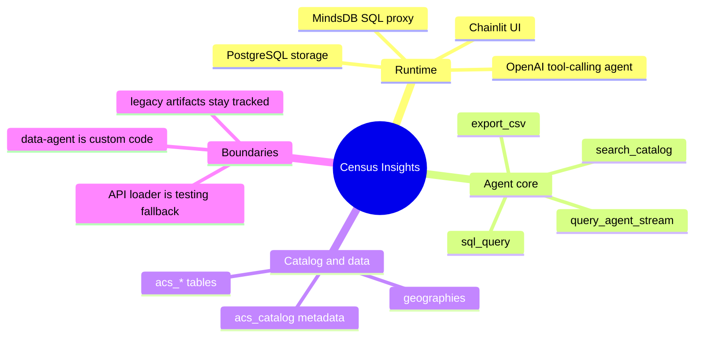

This opening map exists to anchor the reader in the product's fixed constraints before any flow detail appears. The repo is easier to understand as one narrow runtime path plus a small set of historical leftovers than as a long inventory of files.

## System structure

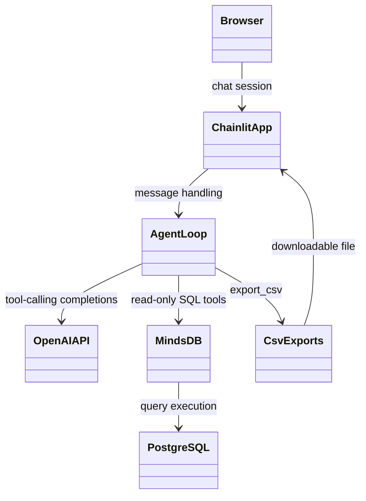

This structure matters because only the Chainlit app and the agent loop are product code; everything else is an integration boundary. Keeping MindsDB in the middle preserves the main architectural constraint: the app must reason through the proxy layer rather than bypass it with direct runtime database clients.

## Startup flow

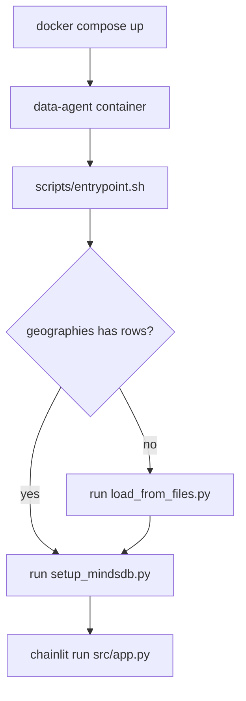

This is the product bootstrap path because the shipped design assumes tract-capable data is available locally and should not be reloaded once populated. The entrypoint still contains a `CENSUS_API_KEY`-based fallback loader in code, but that path exists for testing and is intentionally not part of the main architecture narrative.

## Request lifecycle

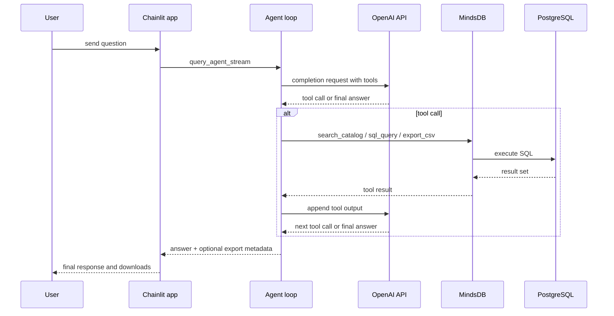

This interaction pattern exists because the model is the planner while the application stays the executor. The loop keeps planning, SQL execution, and user-visible output separated so retries and tool errors can be handled without collapsing the entire conversation path.

## Example happy path

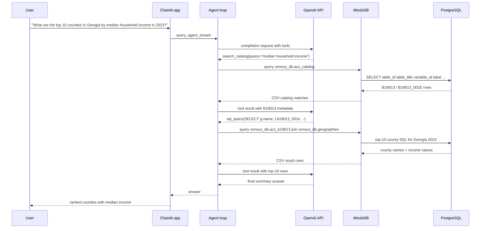

This example is worth drawing because it shows the intended product behavior in one pass: catalog first for schema discovery, MindsDB second for data retrieval, then a plain-language answer built from returned rows rather than guessed table knowledge.

## Streaming agent function map

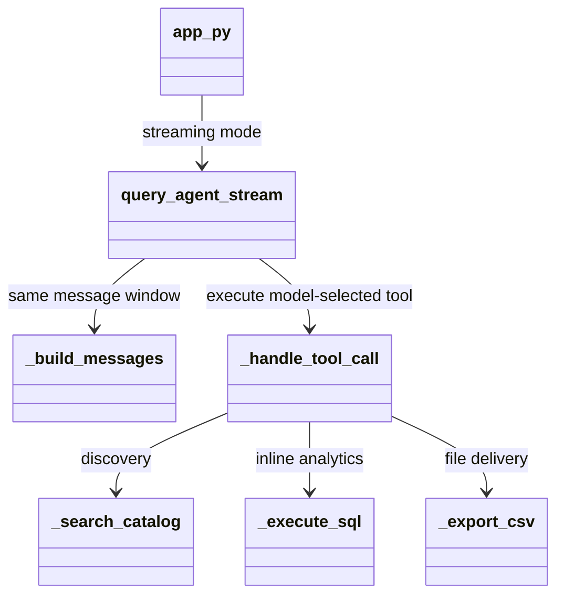

These functions deserve top billing because they are the actual product. The user experience is determined far more by message construction, tool dispatch, retries, and streaming than by how the database was initially loaded.

## Catalog search behavior

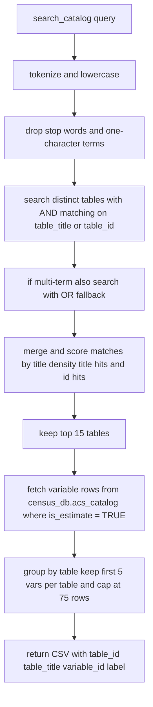

This pipeline matters because catalog search is the agent's real source of truth for schema discovery. The runtime succeeds not by guessing ACS columns, but by narrowing a large metadata surface into a small CSV payload the model can reliably read before composing SQL.

## Catalog storage and query path

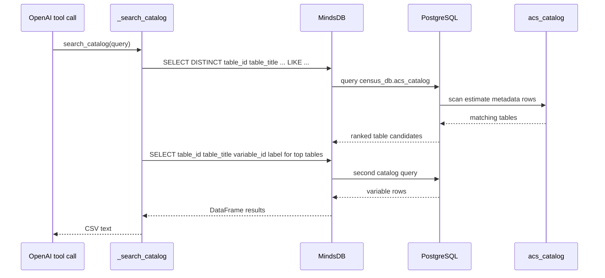

This split query path exists to keep discovery cheap and deterministic: table ranking first, variable extraction second. `scripts/init_db.sql` provisions FTS indexes on `table_title` and `label`, but the current agent intentionally uses simple `LIKE` matching and Python-side ranking so the model sees stable, explicit results.

## Agent decision flow

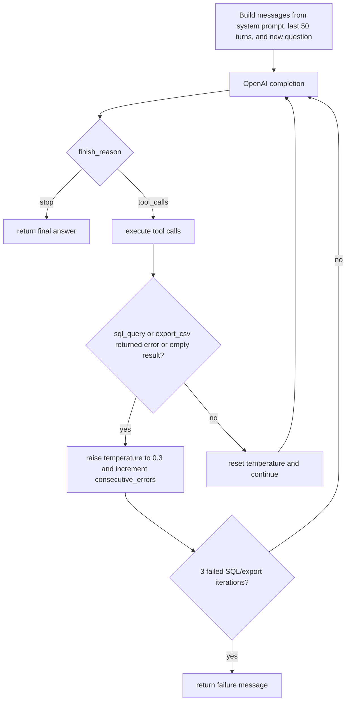

This flow is intentionally conservative because the product needs bounded recovery rather than open-ended agent wandering. The retry logic only reacts to SQL and export outcomes so catalog discovery can remain cheap while the expensive failure modes stay tightly capped.

## SQL guardrails and limits

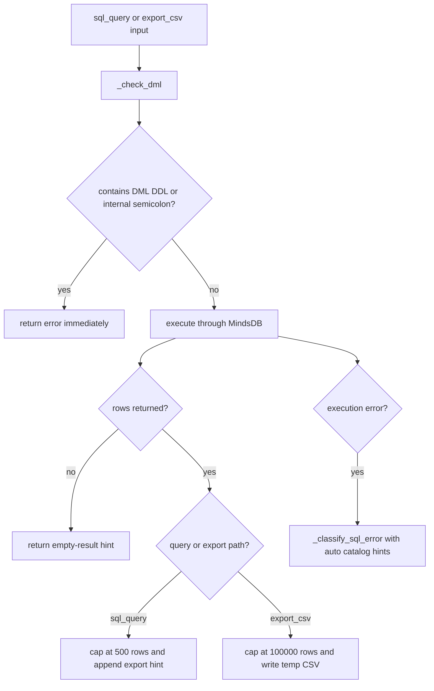

These guardrails are central because the product promises useful analysis without handing the model unrestricted SQL power. The row caps, DML rejection, and classified error hints shape the agent's real behavior more than the load pipeline does.

## Tool structure

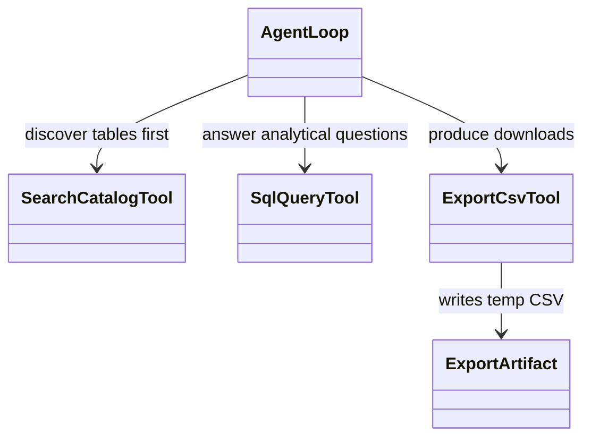

This narrow tool surface exists to bound model behavior and keep every risky operation behind one safety layer. Three tools are enough to separate discovery, inline analysis, and file delivery without encouraging the model to improvise extra capabilities.

## Streaming runtime

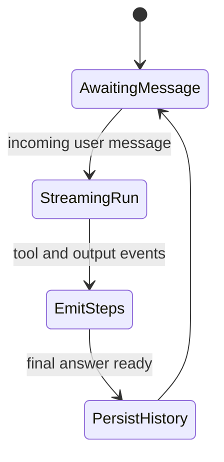

The documented product runtime is streaming because that is the user-facing path the app is intended to operate with. Step emission is part of the product behavior, not an optional extra in the design narrative.

## Data model

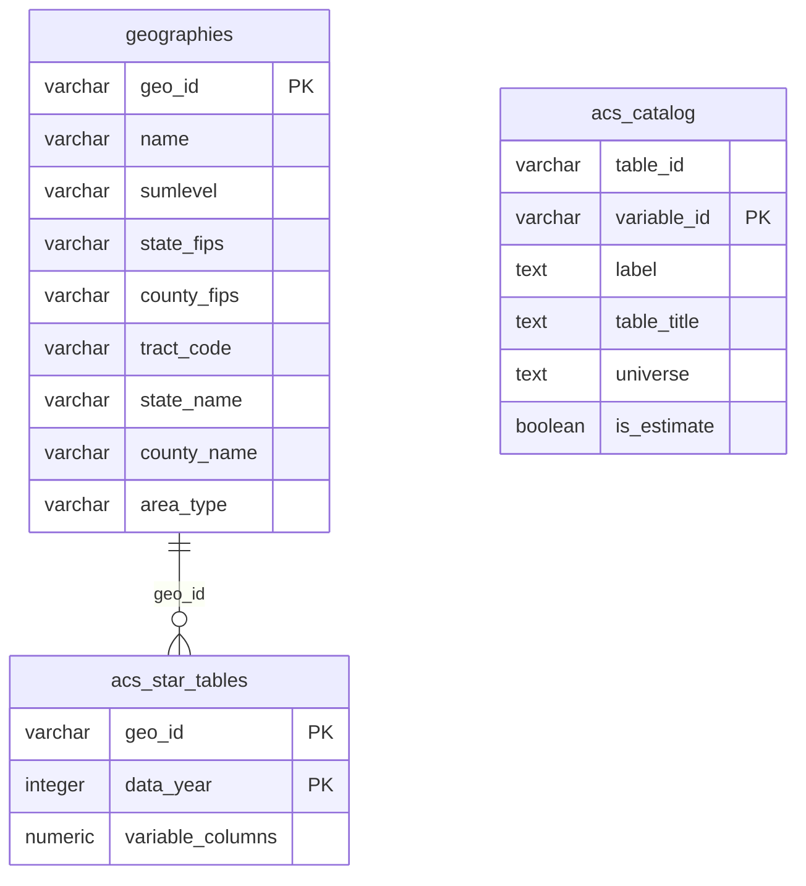

This schema favors one ACS table per table group because the agent can discover intent from catalog metadata instead of relying on a hand-curated semantic layer. The ER node labeled `acs_star_tables` is conceptual shorthand for the many auto-created `acs_<table_id>` tables rather than one literal table, which keeps the diagram aligned with the actual schema in `scripts/init_db.sql`.

## Primary data load

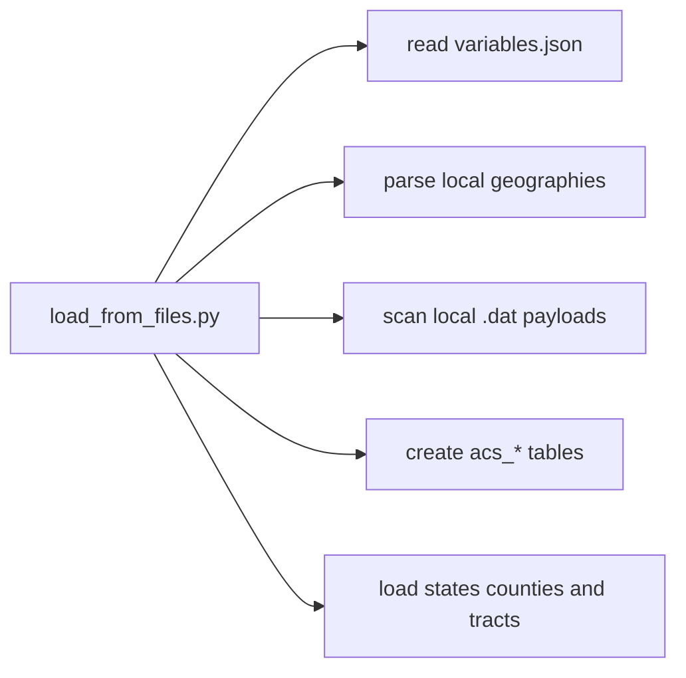

This is the documented load path because it is the only path that matches the product's tract-aware behavior. A narrower API-based loader remains in the codebase as a testing fallback, but it is intentionally outside the primary design story.

## Geography guarantee

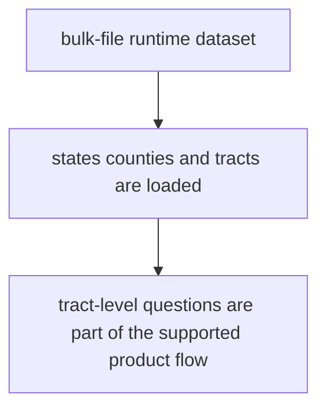

This guarantee is shown explicitly because tract queries are part of the product contract, not an edge capability. The testing-only API loader is omitted here so the supported runtime story stays aligned with the intended deployment.

## Repository structure

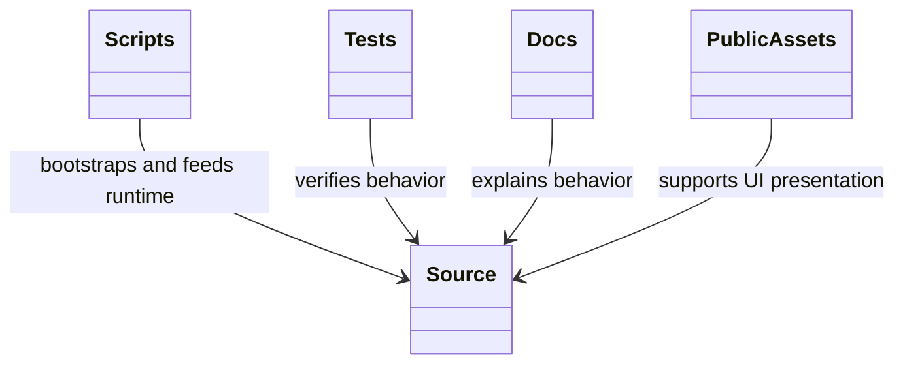

This structural view exists to emphasize that the repo is small but layered: runtime code, operational scripts, verification, and explanation each have a separate home. That separation keeps the built product maintainable even though ETL, app logic, and UI assets coexist in one repository.

## Active and historical artifacts

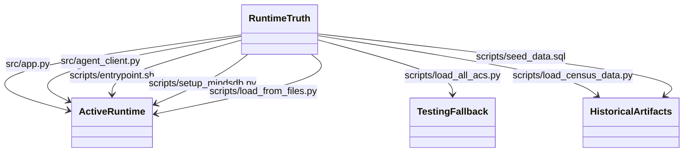

This split is drawn explicitly because the repo mixes product runtime files, testing fallback code, and older artifacts in one tree. Without that boundary, readers can easily mistake support code for the primary architecture.

## Source-of-truth files

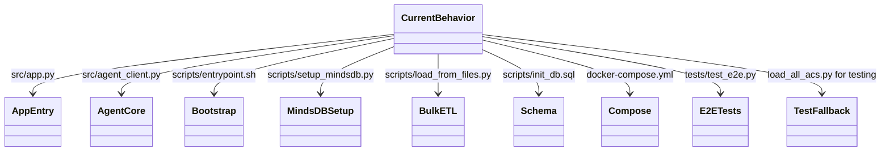

This hierarchy matters because code must outrank narrative when the two disagree. The doc is useful only if it points maintainers back to the exact files that define runtime truth.
