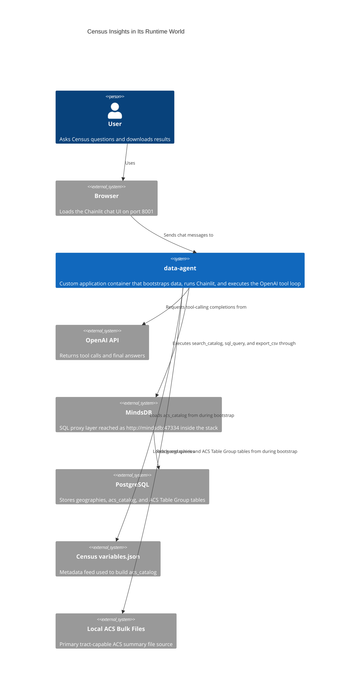
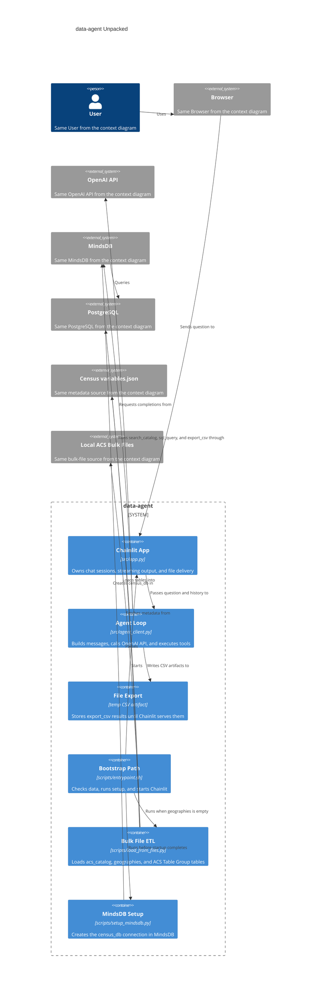
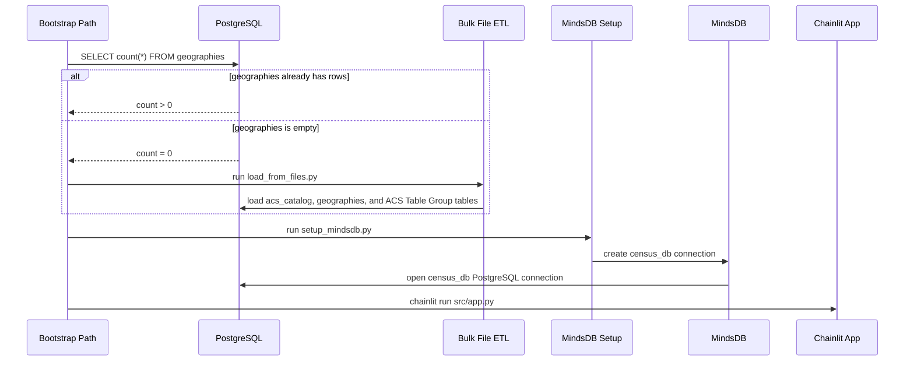
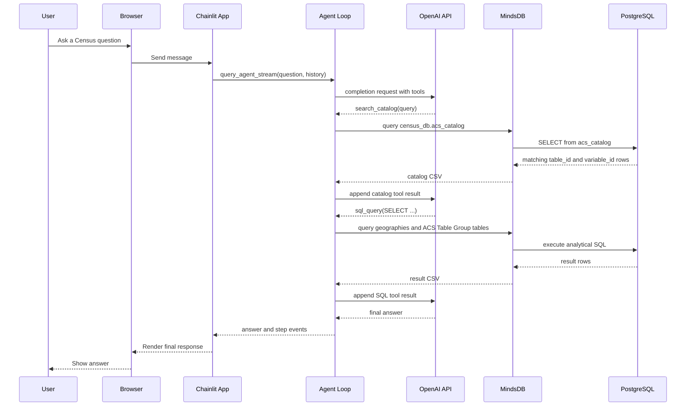
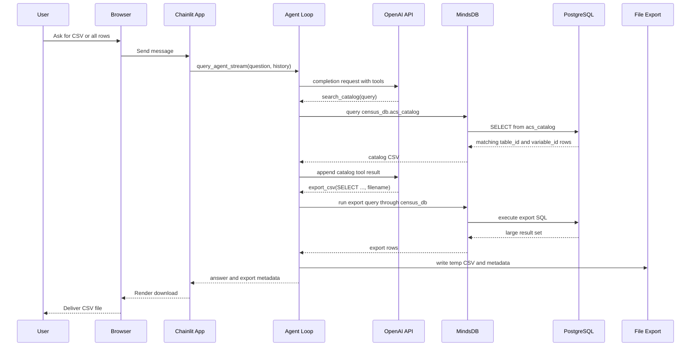
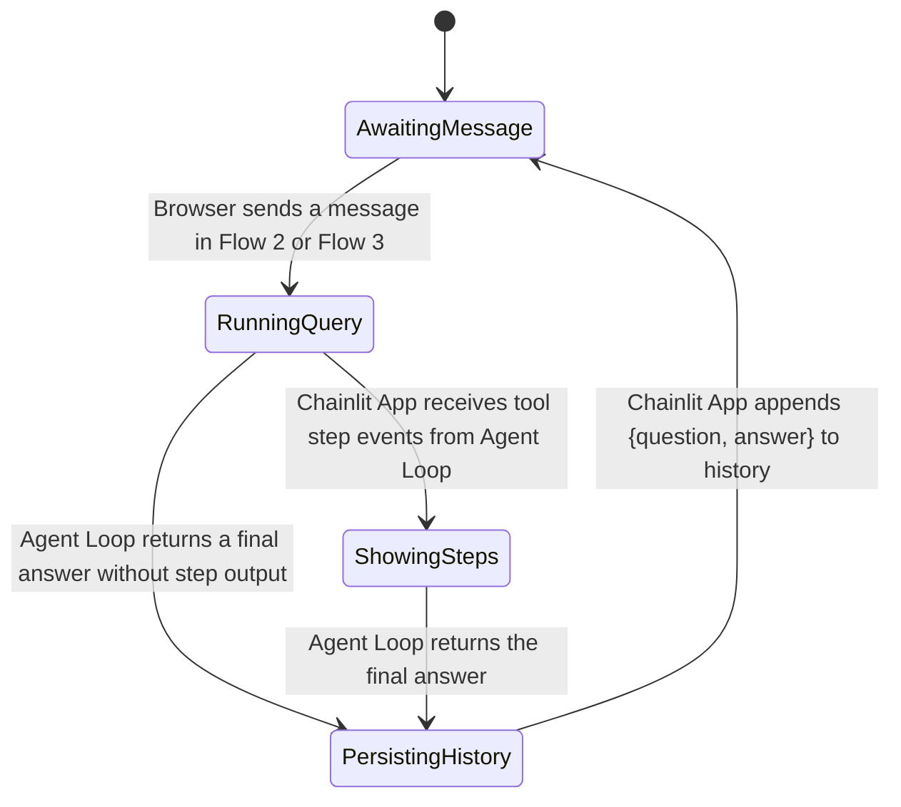
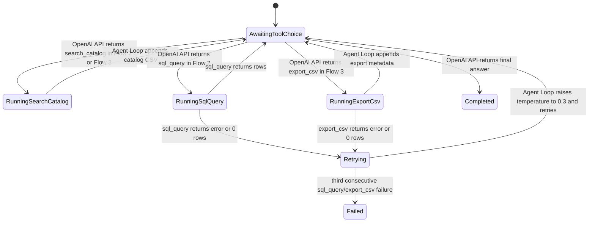
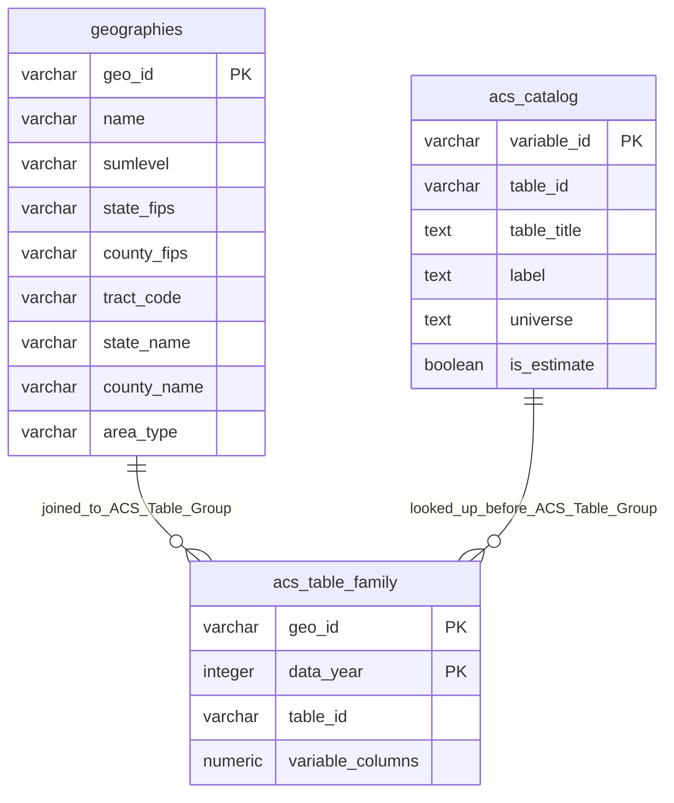
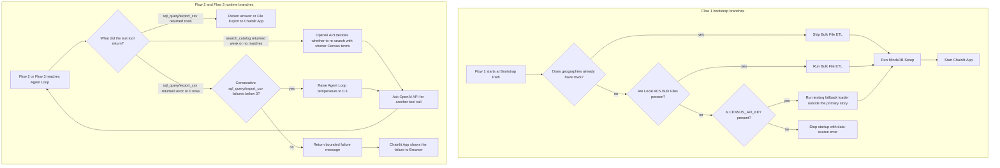

# Current Implementation Visual Story

This diagram-first companion retells the live product as one camera move: world, shape, motion, state, data, and risk.

It complements `docs/analysis/2026-03-07-current-implementation-design.md` rather than replacing it. If this document and the source-of-truth design doc ever drift, the code and the source-of-truth design doc win.

Across the diagrams, `ACS Table Group` is the diagram-safe stand-in for the runtime `acs_<table_id>` table family.

## 1. The World

We begin with the system in its environment. The `User` reaches the product through the `Browser`, while `data-agent` bridges the application runtime to the services and data sources around it.

Now that `data-agent` is the box we care about, the next view opens it up. The `User`, `Browser`, `OpenAI API`, `MindsDB`, and `PostgreSQL` stay in frame so the inside of the system never loses its surroundings.

## 2. The Shape

The `User` from the context diagram still enters through the `Browser`, but the request now lands inside `data-agent`. This view shows the major runtime blocks that turn one container into a working product.

With the major pieces named, we can watch them move. The next three sequences reuse the same `Bootstrap Path`, `Chainlit App`, `Agent Loop`, `File Export`, `MindsDB`, and `PostgreSQL` names from this container view.

## 3. The Motion

### Flow 1 - Bootstrap the bulk-file happy path

Before the `User` can reach the `Chainlit App`, `Bootstrap Path` has to make the data and `MindsDB` connection real. `scripts/init_db.sql` has already created the foundation schema when `PostgreSQL` starts, and this sequence shows the bulk-file happy path that runs when `geographies` is empty and local ACS files are present.

### Flow 2 - Answer an analytical question

Now the `User` from the context diagram reaches the running `Chainlit App`. The `Agent Loop` asks `OpenAI API` what tool to use, discovers schema through `acs_catalog`, then reads the data rows through `MindsDB` and `PostgreSQL`.

### Flow 3 - Produce a CSV export

This time the same `Chainlit App` and `Agent Loop` from Flow 2 stay in play, but the last leg changes. Instead of ending with a text-only answer, `Agent Loop` writes to `File Export` so the `Browser` can deliver a download.

The sequences tell us what happens; the next diagrams show what those movements do to long-lived things. `Chainlit App` owns the chat-facing lifecycle, while `Agent Loop` owns the tool-execution lifecycle created by Flows 2 and 3.

## 4. The State

### Chat Session lifecycle

The `Chainlit App` from the shape diagram keeps the conversation alive between requests. Its state changes are driven directly by the message and answer handoffs in Flow 2 and Flow 3 above.

### Query Run lifecycle

The `Agent Loop` from the shape diagram creates one `Query Run` per user question. When `OpenAI API` sends `search_catalog`, `sql_query`, or `export_csv` in Flow 2 or Flow 3 above, the run moves through bounded tool states instead of improvising outside the three-tool surface.

Those lifecycle transitions only matter because the same tables keep appearing underneath them. The next view maps the rows touched in Flow 1, Flow 2, and Flow 3 to the data structures the runtime actually depends on.

## 5. The Data

`geographies` and `acs_catalog` already appeared by name in Flow 1 and Flow 2, and the analytical tables appeared there as `ACS Table Group`. This ER view ties that diagram-safe name back to the runtime `acs_<table_id>` naming pattern.

The `acs_table_family` node is conceptual shorthand for the runtime `acs_<table_id>` tables seen earlier as `ACS Table Group`. The ER lines describe the runtime join and lookup relationships the `Agent Loop` uses, not declared foreign keys on every auto-created ACS table.

## 6. The Risk

Finally, the happy paths above need edges. When Flow 1, Flow 2, or Flow 3 breaks, the runtime follows explicit branches instead of wandering off-model.

That closes the zoom: the `User` from the first diagram reaches `Browser`, `Chainlit App`, and `Agent Loop`; those flows move `Query Run` and `Chat Session`; those states operate over `geographies`, `acs_catalog`, and `ACS Table Group` storage; and when the path breaks, the recovery tree stays bounded to the same named components.
