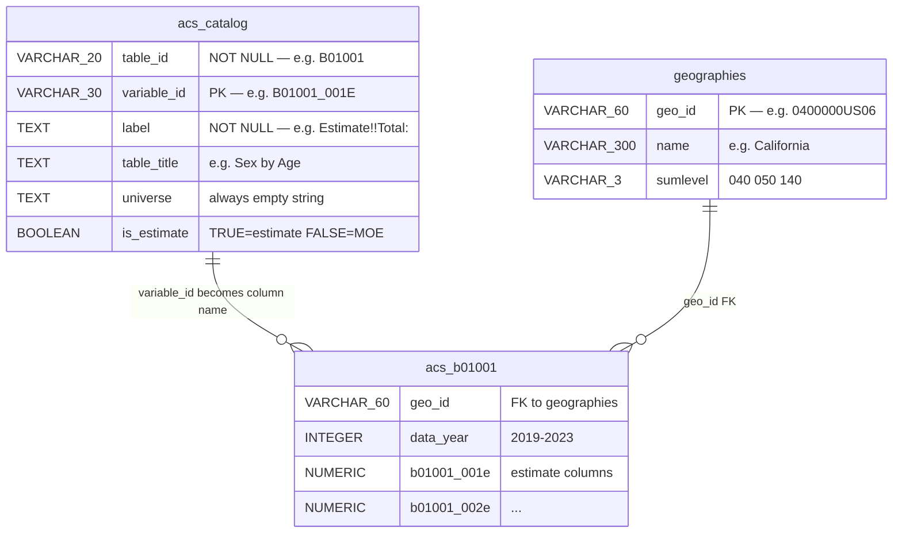
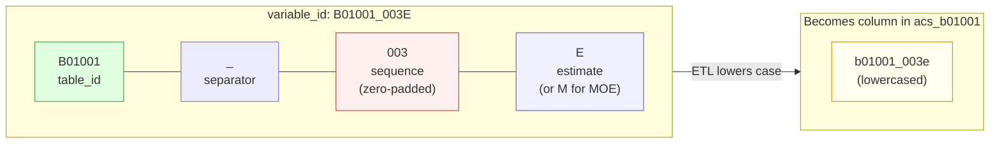
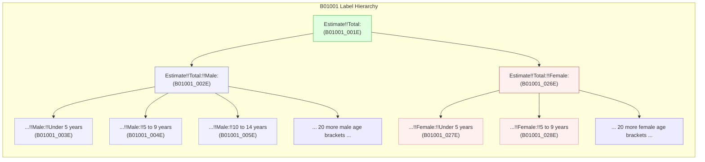
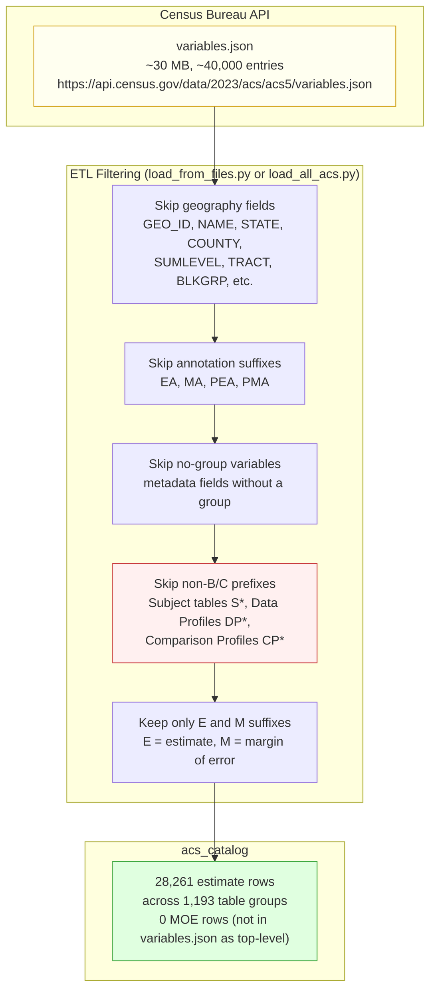
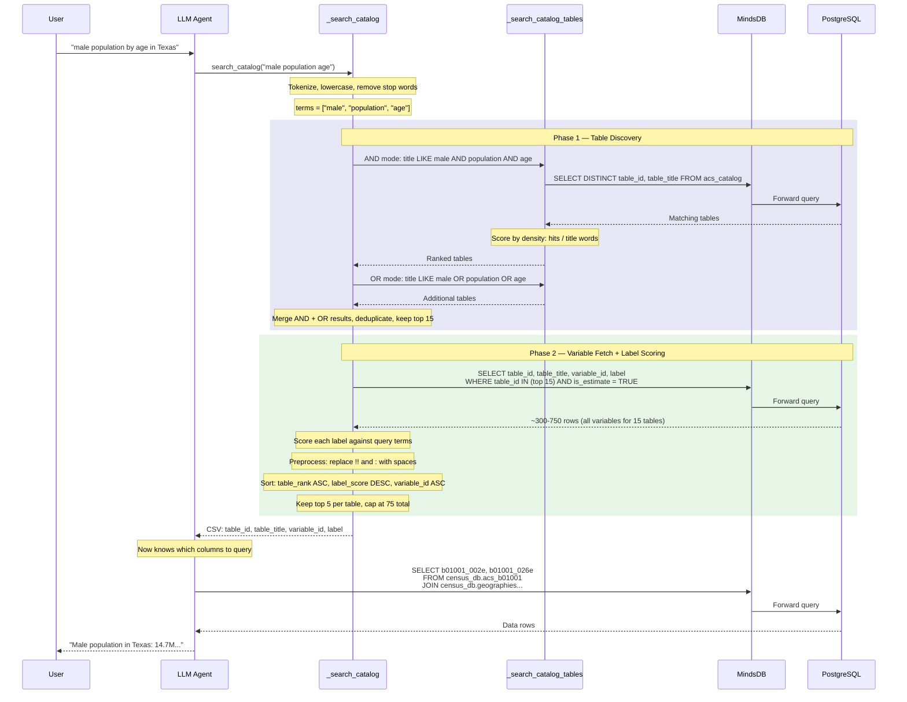
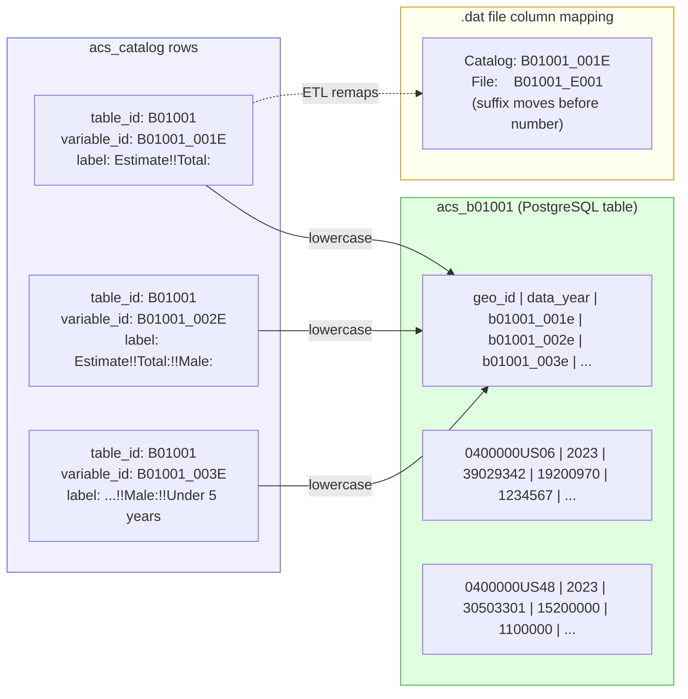

# Anatomy of `acs_catalog` — The Census Data Discovery Layer
read variables_to_catalog.md first.

`acs_catalog` is the metadata registry that bridges natural language and SQL column names. The LLM agent cannot query data tables by guessing — there are 1,193 table groups with 28,261 estimate variables. The catalog is how the agent discovers what exists and what it means.

## 1. Schema

6 columns. `variable_id` is the primary key.

```
acs_catalog
├── table_id     VARCHAR(20)  NOT NULL    -- 'B01001'
├── variable_id  VARCHAR(30)  PRIMARY KEY -- 'B01001_001E'
├── label        TEXT         NOT NULL    -- 'Estimate!!Total:'
├── table_title  TEXT                     -- 'Sex by Age'
├── universe     TEXT                     -- '' (unpopulated)
└── is_estimate  BOOLEAN      DEFAULT TRUE
```

Three indexes accelerate discovery:

```
idx_catalog_table      btree(table_id)           — fast group lookup
idx_catalog_title_fts  GIN(tsvector(table_title)) — full-text on titles
idx_catalog_label_fts  GIN(tsvector(label))       — full-text on labels
```



## 2. Column Deep-Dive

### `table_id` — The Organizational Unit

Each table groups related variables about a single Census topic. Format: `{prefix}{sequence}` with optional race suffix.

```mermaid
flowchart TD
    subgraph TableID["table_id Format"]
        direction TB
        BASE["Base table: B01001<br/>Sex by Age — 49 estimate variables"]
        RACE_A["B01001A — White Alone"]
        RACE_B["B01001B — Black or African American Alone"]
        RACE_C["B01001C — American Indian and Alaska Native Alone"]
        RACE_D["B01001D — Asian Alone"]
        RACE_E["B01001E — Native Hawaiian and Other Pacific Islander Alone"]
        RACE_F["B01001F — Some Other Race Alone"]
        RACE_G["B01001G — Two or More Races"]
        RACE_H["B01001H — White Alone, Not Hispanic or Latino"]
        RACE_I["B01001I — Hispanic or Latino"]
        BASE --> RACE_A
        BASE --> RACE_B
        BASE --> RACE_C
        BASE --> RACE_D
        BASE --> RACE_E
        BASE --> RACE_F
        BASE --> RACE_G
        BASE --> RACE_H
        BASE --> RACE_I
    end

    style BASE fill:#e0ffe0,stroke:#44aa44,color:#333
    style RACE_A fill:#f0f0ff,stroke:#6666cc,color:#333
    style RACE_B fill:#f0f0ff,stroke:#6666cc,color:#333
    style RACE_C fill:#f0f0ff,stroke:#6666cc,color:#333
    style RACE_D fill:#f0f0ff,stroke:#6666cc,color:#333
    style RACE_E fill:#f0f0ff,stroke:#6666cc,color:#333
    style RACE_F fill:#f0f0ff,stroke:#6666cc,color:#333
    style RACE_G fill:#f0f0ff,stroke:#6666cc,color:#333
    style RACE_H fill:#f0f0ff,stroke:#6666cc,color:#333
    style RACE_I fill:#f0f0ff,stroke:#6666cc,color:#333
```



**Real table type distribution** (2023 ACS 5-Year):

| Type | Count | Example |
|---|---|---|
| B (Detailed) | 661 | `B01001` Sex by Age |
| Race iterations | 498 | `B01001A` through `B01001I` |
| C (Collapsed) | 34 | `C17002` Ratio of Income to Poverty Level |
| **Total** | **1,193** | |

**Table size range**: 1 variable (`B01003` Total Population) to 566 variables (`B24121` Detailed Occupation by Earnings). Median is 10 variables.

### `variable_id` — The Column Key

Format: `{table_id}_{sequence}{suffix}`



**Real examples from B01001** (Sex by Age):

| variable_id | Suffix | Meaning |
|---|---|---|
| `B01001_001E` | E | Total population (estimate) |
| `B01001_002E` | E | Male (subtotal) |
| `B01001_003E` | E | Male, under 5 years |
| `B01001_004E` | E | Male, 5 to 9 years |
| `B01001_005E` | E | Male, 10 to 14 years |
| ... | | ... |
| `B01001_049E` | E | Female, 85 years and over |

MOE variables like `B01001_001M` exist in the Census API (referenced in the `attributes` field of each estimate) but are **not top-level entries** in `variables.json`. The ETL's `endswith("M")` filter finds zero matches. In practice, **the catalog contains only estimate rows** (28,261 of them).

### `label` — The Semantic Heart

Labels use `!!` as hierarchical separators and `:` as subtotal/terminal markers. This is the most information-dense column.



**Hierarchy depth varies by table** — real examples from B08301 (Transportation to Work):

| variable_id | Depth | Label |
|---|---|---|
| `B08301_001E` | 1 | `Estimate!!Total:` |
| `B08301_002E` | 2 | `Estimate!!Total:!!Car, truck, or van:` |
| `B08301_003E` | 3 | `Estimate!!Total:!!Car, truck, or van:!!Drove alone` |
| `B08301_004E` | 3 | `Estimate!!Total:!!Car, truck, or van:!!Carpooled:` |
| `B08301_005E` | 4 | `Estimate!!Total:!!Car, truck, or van:!!Carpooled:!!In 2-person carpool` |
| `B08301_010E` | 2 | `Estimate!!Total:!!Public transportation (excluding taxicab):` |
| `B08301_011E` | 3 | `Estimate!!Total:!!Public transportation (excluding taxicab):!!Bus` |
| `B08301_012E` | 3 | `Estimate!!Total:!!Public transportation (excluding taxicab):!!Subway or elevated rail` |

**The `!!` trap**: Searching for `"male"` in `"Estimate!!Total:!!Male:!!Under 5 years"` fails with naive substring matching because `Male` is embedded inside `!!Male:!!`. The label-relevance scoring in `_search_catalog()` preprocesses labels — replacing `!!` and `:` with spaces — before term matching.

### `table_title` — Denormalized Group Name

Same value repeated for every variable in the same `table_id`. The `concept` field from `variables.json` is stored here.

**Real examples**:

| table_id | table_title |
|---|---|
| `B01001` | Sex by Age |
| `B01003` | Total Population |
| `B02001` | Race |
| `B08301` | Means of Transportation to Work |
| `B19013` | Median Household Income in the Past 12 Months (in 2023 Inflation-Adjusted Dollars) |
| `B25001` | Housing Units |
| `C17002` | Ratio of Income to Poverty Level in the Past 12 Months |

### `universe` — Unpopulated

Intended to hold the population being counted (e.g., "Total population", "Households", "Housing units", "Workers 16 years and over"). The `variables.json` endpoint does not provide universe per-variable — it is a table-level property from the separate `groups.json` endpoint. The ETL inserts empty string for every row.

### `is_estimate` — Estimate vs. MOE Flag

Set to `TRUE` for variables ending in `E`, `FALSE` for `M`. In practice, only `TRUE` rows exist because MOE variables are not top-level entries in the 2023 `variables.json`.

All agent queries filter `WHERE is_estimate = TRUE`.

## 3. Data Source and ETL Pipeline

The catalog is populated from a single Census Bureau endpoint — no API key required.



**Raw JSON for a single variable** (B01001_001E):

```json
{
  "label": "Estimate!!Total:",
  "concept": "Sex by Age",
  "predicateType": "int",
  "group": "B01001",
  "limit": 0,
  "attributes": "B01001_001EA,B01001_001M,B01001_001MA"
}
```

The ETL maps these JSON fields to catalog columns:

| JSON field | Catalog column | Example |
|---|---|---|
| `group` | `table_id` | `B01001` |
| *(key name)* | `variable_id` | `B01001_001E` |
| `label` | `label` | `Estimate!!Total:` |
| `concept` | `table_title` | `Sex by Age` |
| *(not available)* | `universe` | `""` |
| *(derived from suffix)* | `is_estimate` | `TRUE` |

Both ETL loaders (`load_from_files.py` line 125 and `load_all_acs.py` line 175) run identical catalog population logic. The catalog is loader-independent.

## 4. How the Agent Uses the Catalog

Two-phase discovery: find tables by title, then find variables by label.



## 5. Catalog to Data Table Mapping

Each catalog `variable_id` becomes a physical column in a PostgreSQL data table.



**The column name transformation**:
- Catalog stores: `B01001_001E` (human convention: table_sequenceSuffix)
- Data table uses: `b01001_001e` (lowercased)
- Raw .dat files use: `B01001_E001` (suffix-first: table_SuffixSequence)

The ETL in `load_from_files.py` handles this remapping at line 438 (`_catalog_to_file_col`).

## 6. Scale Summary

All numbers verified against the 2023 ACS 5-Year `variables.json` endpoint.

| Metric | Value |
|---|---|
| Total catalog rows | 28,261 |
| Distinct table groups | 1,193 |
| B (Detailed) tables | 661 |
| Race-iteration tables | 498 |
| C (Collapsed) tables | 34 |
| Smallest table | 1 variable (B01003 Total Population) |
| Largest table | 566 variables (B24121 Occupation by Earnings) |
| Median table size | 10 variables |
| Mean table size | 23.7 variables |
| MOE rows | 0 (not top-level in variables.json) |
| Label hierarchy max depth | 4 levels (e.g. B08301 Transportation) |
