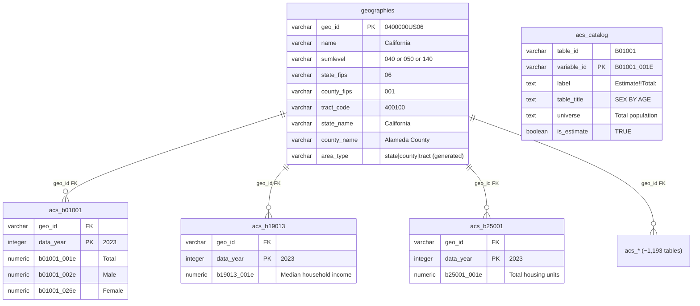

# Full ACS 5-Year Schema Design — v2

**Date:** 2026-02-05
**Status:** Final (post multi-model review)
**Updated:** 2026-02-07 — Census tract support, bulk file ETL, actual data volumes, production deployment.
**Supersedes:** All prior design docs (5-table schema, super view, MindsDB agent)

---

## 1. Executive Summary

The POC evolved from a hand-curated 5-table schema (demographics, economics, education, housing, geo_areas) with 48 derived variables to a full ACS 5-Year schema with **~1,193 auto-generated tables** covering every B- and C-prefix Detailed Table published by the Census Bureau.

**Why:** The 5-table schema forced upfront decisions about which data to include. Users asking about commuting, language, ancestry, disability, veterans, or any of the hundreds of other ACS topics found no data. The full schema lets the agent discover any ACS topic dynamically via a catalog search tool.

**What changed:**

| Aspect | v1 (5-table) | v2 (full ACS) |
|--------|-------------|---------------|
| Tables | 5 hand-curated | ~1,193 auto-generated + 2 foundation |
| Variables | 48 derived (pct_male, unemployment_rate) | ~30,000+ raw Census variables (b01001_001e) |
| Column discovery | Hardcoded in system prompt | Agent searches `acs_catalog` at runtime |
| MindsDB role | Super view + built-in agent | Pure SQL proxy (no views, no agent) |
| Data source | Census API, 48 specific variables | Census API or bulk Summary Files, all B/C table groups |
| Geography levels | States + counties | States + counties + census tracts (~89,500 geographies) |
| ETL runtime | ~5 minutes (40 API calls) | API: ~2-4 hours (~12,000+ calls); Bulk files: ~45 min |
| Database size | ~500 MB | ~75 GB (with tracts) |

---

## 2. Schema Design

### 2.1 Foundation Tables

Two tables created by `scripts/init_db.sql`. These are permanent and populated once.

#### geographies

Geographic reference for all states, counties, and census tracts. Source: Census API endpoints or local geo files from bulk Summary Files.

```sql
CREATE TABLE geographies (
    geo_id      VARCHAR(60) PRIMARY KEY,  -- e.g., '0400000US06' (CA), '1400000US06001400100' (tract)
    name        VARCHAR(300) NOT NULL,    -- Full display name from Census
    sumlevel    VARCHAR(3)  NOT NULL,     -- '040' = state, '050' = county, '140' = tract
    state_fips  VARCHAR(2),               -- 2-digit state FIPS
    county_fips VARCHAR(3),               -- 3-digit county FIPS (NULL for states)
    tract_code  VARCHAR(6),              -- 6-digit tract code (sumlevel 140 only)
    state_name  VARCHAR(100),             -- State name
    county_name VARCHAR(200),             -- County name (NULL for states and tracts)
    area_type   VARCHAR(20) GENERATED ALWAYS AS (
        CASE sumlevel
            WHEN '040' THEN 'state'
            WHEN '050' THEN 'county'
            WHEN '140' THEN 'tract'
            ELSE 'other'
        END
    ) STORED
);

CREATE INDEX idx_geo_sumlevel  ON geographies(sumlevel);
CREATE INDEX idx_geo_state     ON geographies(state_fips);
CREATE INDEX idx_geo_county    ON geographies(state_fips, county_fips);
CREATE INDEX idx_geo_area_type ON geographies(area_type);
```

**Row count:** ~89,561 (52 states/territories + ~3,230 counties + ~86,279 census tracts)

#### acs_catalog

Variable metadata for agent discovery. Source: Census API `variables.json` endpoint.

```sql
CREATE TABLE acs_catalog (
    table_id    VARCHAR(20) NOT NULL,     -- ACS table group, e.g., 'B01001'
    variable_id VARCHAR(30) PRIMARY KEY,  -- Full variable ID, e.g., 'B01001_001E'
    label       TEXT NOT NULL,            -- Human label, e.g., 'Estimate!!Total:'
    table_title TEXT,                     -- Table concept, e.g., 'SEX BY AGE'
    universe    TEXT,                     -- Universe, e.g., 'Total population'
    is_estimate BOOLEAN DEFAULT TRUE      -- TRUE = estimate (E), FALSE = MOE (M)
);

CREATE INDEX idx_catalog_table     ON acs_catalog(table_id);
CREATE INDEX idx_catalog_title_fts ON acs_catalog
    USING gin(to_tsvector('english', table_title));
CREATE INDEX idx_catalog_label_fts ON acs_catalog
    USING gin(to_tsvector('english', label));
```

**Row count:** ~30,000+ (all B/C estimate + MOE variable definitions)

### 2.2 Auto-Generated ACS Data Tables

Created dynamically by `scripts/load_all_acs.py` (API) or `scripts/load_from_files.py` (bulk files) for each ACS table group.

**Naming convention:** `acs_{table_id_lowercase}` (e.g., `acs_b01001`, `acs_b19013`, `acs_c27010`)

**Standard structure:**

```sql
CREATE TABLE acs_b01001 (
    geo_id      VARCHAR(60) REFERENCES geographies(geo_id),
    data_year   INTEGER NOT NULL,
    b01001_001e NUMERIC,    -- Estimate: Total
    b01001_002e NUMERIC,    -- Estimate: Male
    b01001_003e NUMERIC,    -- Estimate: Male: Under 5 years
    ...                     -- One column per estimate variable
    PRIMARY KEY (geo_id, data_year)
);
```

**Key design decisions:**
- Column names are **lowercase variable IDs** (e.g., `B01001_001E` becomes `b01001_001e`)
- All data columns are `NUMERIC` — handles integers and decimals without loss
- **Estimates only** — MOE (margin of error) columns are not loaded (see Section 6.3)
- No FK constraint in practice (bulk ETL uses `NOT NULL` only for performance)
- Composite PK `(geo_id, data_year)` for multi-year data

### 2.3 Data Volume (Actual)

| Dimension | Count |
|-----------|-------|
| Geographies (states + counties + tracts) | ~89,561 |
| — States/territories | 52 |
| — Counties | ~3,230 |
| — Census tracts | ~86,279 |
| ACS table groups (B + C prefix) | ~1,193 |
| Years loaded | 5 (2019-2023) |
| Rows per table (all years) | ~447,805 |
| **Total data rows** | **~534 million** |
| Columns per table (median) | ~10-50 |
| Catalog entries | ~30,000+ |
| **Actual DB size** | **~75 GB** |

### 2.4 Index Strategy

| Table Type | Indexes | Rationale |
|-----------|---------|-----------|
| `geographies` | B-tree on sumlevel, state_fips, (state_fips, county_fips), area_type | Frequently filtered by agent; compound index for tract lookups by county |
| `acs_catalog` | B-tree on table_id; GIN full-text on title, label | Agent catalog search |
| `acs_*` data tables | PK only (geo_id, data_year) | ~448K rows each with tracts — adding indexes to ~1,193 tables would balloon the 75GB database further. PK covers most query patterns. |

---

## 3. ETL Pipeline

Two ETL paths are available. Both produce the same schema — the entrypoint auto-selects based on what's present:

| ETL Path | Script | Geography Levels | Runtime | Requires |
|----------|--------|-------------------|---------|----------|
| **Bulk files** (preferred) | `scripts/load_from_files.py` | States + counties + tracts | ~45 min | Local Summary Files (~53 GB download) |
| **Census API** (fallback) | `scripts/load_all_acs.py` | States + counties only | ~2-4 hours | `CENSUS_API_KEY` env var |

The entrypoint (`scripts/entrypoint.sh`) checks: local bulk files at `/app/data/raw/acs/` first → Census API if `CENSUS_API_KEY` set → error if neither.

**Bulk file download:** `bash scripts/download_acs_bulk.sh` downloads all 5 years of ACS Summary Files from Census FTP (~53 GB total). Uses `wget -c` for resumable downloads. Files saved to `data/raw/acs/{year}/`.

### 3.1 Census API Endpoints (API path only)

| Step | Endpoint | Purpose |
|------|----------|---------|
| Catalog | `GET /data/2023/acs/acs5/variables.json` | All variable metadata (~30MB JSON) |
| State geo | `GET /data/2023/acs/acs5?get=NAME&for=state:*` | State FIPS + names |
| County geo | `GET /data/2023/acs/acs5?get=NAME&for=county:*` | County FIPS + names |
| Data | `GET /data/{year}/acs/acs5?get=NAME,{vars}&for=state:*` | Per-table per-year |
| Data | `GET /data/{year}/acs/acs5?get=NAME,{vars}&for=county:*` | Per-table per-year |

**Note:** The API path does not load census tracts (would require ~86K additional API calls per table per year). Use bulk files for tract-level data.

### 3.2 Three-Step Process

Both ETL paths follow the same three steps:

```
Step 1: Populate acs_catalog
  └─ Fetch variables.json from Census API (one call, ~30MB, no API key needed)
  └─ Filter: B/C prefix only, skip annotations (EA/MA/PEA/PMA)
  └─ Classify: E suffix → estimate, M suffix → MOE
  └─ Bulk insert with ON CONFLICT DO NOTHING

Step 2: Populate geographies
  ├─ [API path] Fetch state + county geos (two API calls)
  │   └─ Build geo_id: 0400000US{fips} for states, 0500000US{state}{county} for counties
  └─ [Bulk path] Parse local geos.csv/geos.txt files (one per year)
      └─ Filter to sumlevels 040, 050, 140 (state/county/tract)
      └─ Build geo_id: 0400000US, 0500000US, 1400000US prefixes
      └─ Deduplicate across years via UPSERT

Step 3: Load ~1,193 ACS data tables
  ├─ [API path] Sequential by table, parallel API calls within
  │   └─ Batch variables into groups of 49 (API limit = 50 including NAME)
  │   └─ Fetch state + county data in parallel (15 workers)
  │   └─ Merge batches by geo_id
  └─ [Bulk path] Multiprocessing pool across tables (default 4 workers)
      └─ Parse pipe-delimited .dat files per year
      └─ Column name mapping: catalog B01001_001E → file B01001_E001
      └─ Filter rows to kept GEO_ID prefixes (state/county/tract)
  └─ [Both] Convert sentinel values → NULL, bulk insert
```

### 3.3 Parallelism Strategy

**API path (`load_all_acs.py`):**
- **Table level:** Sequential (one at a time, own DB connection)
- **API call level:** `ThreadPoolExecutor(max_workers=15)` — all (batch, geo_level) combinations for a table/year run concurrently
- **Rationale:** 15 concurrent requests saturates Census API throughput without triggering rate limits.

**Bulk file path (`load_from_files.py`):**
- **Table level:** `multiprocessing.Pool(workers=4)` — multiple tables loaded in parallel
- **File I/O:** Sequential within each table (one .dat file per year)
- **Rationale:** File parsing is CPU-bound (not I/O-bound like API calls), so multiprocessing is more effective than threading. Each worker gets its own DB connection.

### 3.4 Error Handling / Idempotency

| Scope | Strategy |
|-------|----------|
| Full run | Checks if `geographies` has rows → skips if already loaded |
| Catalog | `ON CONFLICT DO NOTHING` — safe to re-run |
| Data tables | `DROP TABLE IF EXISTS` + `CREATE TABLE` — destructive but deterministic |
| Per-year | Try/except → log error, rollback, continue to next year |
| Per-table | Try/except → log error, continue to next table |
| API calls | 3 retries with exponential backoff (2^attempt + 1 seconds) on 429/5xx |
| Sentinel values | -666666666, -555555555, -333333333, -222222222, -999999999 → NULL |

---

## 4. Agent Architecture

### 4.1 Three-Tool Workflow

**Script:** `src/agent_client.py` (576 lines) — Direct OpenAI tool-calling agent. Default model: `gpt-4.1` (configurable via `LLM_MODEL` env var). MindsDB's built-in agent was replaced due to 30-row truncation.

| Tool | Purpose | When to use |
|------|---------|-------------|
| `search_catalog` | Find ACS tables/variables matching a topic | **Always first** — agent must discover table and column names |
| `sql_query` | Execute SELECT through MindsDB → PG, return CSV text (capped at 500 rows) | Analytical queries, aggregations, top-N |
| `export_csv` | Execute SELECT, save full CSV to file (capped at 100K rows) | User asks for CSV, download, all rows, or large exports |

### 4.2 Catalog Discovery Workflow

The catalog search uses a two-phase strategy: Phase 1 finds matching tables (DISTINCT table_id, table_title) using AND, then OR fallback with Python-side scoring. Phase 2 fetches variables for the top 15 tables (capped at 75 variable rows total, 5 per table).

Example: User asks "What is the median household income by state?"

```
1. Agent calls search_catalog("median household income")
   └─ Phase 1: _search_catalog_tables() finds B19013 via ILIKE on table_title
   └─ Phase 2: Fetches variables for top tables, returns CSV:
      table_id,table_title,variable_id,label
      B19013,MEDIAN HOUSEHOLD INCOME...,B19013_001E,Estimate!!Median household income...

2. Agent calls sql_query("""
     SELECT g.state_name, t.b19013_001e AS median_income
     FROM census_db.acs_b19013 t
     JOIN census_db.geographies g ON t.geo_id = g.geo_id
     WHERE g.area_type = 'state' AND t.data_year = 2023
     ORDER BY t.b19013_001e DESC
   """)
   └─ Returns CSV text (result set capped at 500 rows)

3. Agent formats response with $ formatting and table
```

**Error recovery:** If a SQL error references a table (e.g., wrong column name), `_classify_sql_error()` auto-looks up the table's columns via `_auto_search_catalog()` and appends them to the error hint, giving the LLM the correct column names for retry.

**Temperature ramp:** On consecutive SQL errors, temperature increases from 0.0 to 0.3 to encourage different SQL approaches. Resets to 0.0 on success. Gives up after 3 consecutive errors.

### 4.3 System Prompt Design

The system prompt instructs the agent to:
- **Always search catalog first** — never guess table or column names
- Use table naming: `census_db.acs_{table_id}` (lowercase)
- Use column naming: lowercase variable IDs (e.g., `b01001_001e`)
- Join pattern: `JOIN census_db.geographies g ON t.geo_id = g.geo_id`
- Default year: 2023 (data available 2019-2023)
- Use `area_type = 'state'`, `'county'`, or `'tract'`
- Tract GEO_IDs: `1400000US{state_fips}{county_fips}{tract_code}`, filter by `g.state_fips`
- **Never use IN (...) with AND** — use OR instead (MindsDB bug workaround)
- Use `export_csv` for large results, `sql_query` for analytical queries
- Never execute DML

### 4.4 MindsDB as Pure SQL Proxy

MindsDB's role is now minimal:

```python
# setup_mindsdb.py — the entire MindsDB setup
server.create_database(
    "census_db",
    engine="postgres",
    connection_args={
        "user": PG_USER, "password": PG_PASS,
        "host": PG_HOST, "port": PG_PORT, "database": PG_DB,
    },
)
```

- Registers PostgreSQL as `census_db` namespace
- Agent queries: `census_db.acs_b01001`, `census_db.geographies`, `census_db.acs_catalog`
- No MindsDB views, no MindsDB agents, no MindsDB skills
- MindsDB handles connection pooling and wire protocol only
- **Why keep MindsDB?** Production constraint — we don't own the source DB. MindsDB provides the abstraction layer that can later add column suppression via views without modifying the source.

---

## 5. Column Suppression Strategy

**Status: Deferred for v2 POC.**

The v1 schema suppressed 6 columns (race_detail, ancestry_code, per_capita_income, snap_benefits, social_security_income, median_home_value) via MindsDB views. In v2, with ~1,193 tables, manual view creation is not feasible.

**Future options when needed:**
- **Catalog-level filtering:** Exclude sensitive variable IDs from `acs_catalog` and DDL generation. If the catalog doesn't list them, the agent can't discover them.
- **Targeted MindsDB views:** Create views only for specific tables that need partial column suppression.

Both approaches can be added incrementally without schema changes.

---

## 6. Trade-offs and Alternatives

### 6.1 Census API vs Summary File Download

Both ETL paths are now implemented. The entrypoint auto-selects based on what's available.

| Factor | Census API (`load_all_acs.py`) | Bulk Summary Files (`load_from_files.py`) |
|--------|--------------------|--------------------|
| Download size | Incremental (~KB per call) | 11GB zip per year (53GB total) |
| Format | Clean JSON, list-of-lists | Pipe-delimited .dat files |
| Rate limiting | ~50 req/sec with key | None |
| Disk space | Minimal | ~25GB temp per year |
| Geography levels | States + counties only | **States + counties + tracts** |
| Runtime | ~2-4 hours | ~45 min (download separate) |
| Docker-friendly | Yes (no disk) | Requires volume mount |
| DB size | ~15-25 GB | **~75 GB** (tracts add 26x rows) |

**Decision:** Both are available. Bulk files are preferred for production (faster, includes tracts). Census API is the fallback for environments where the 53GB download isn't practical. The production deployment on trimurthi uses data loaded via bulk files, transferred as a pg_dump.

### 6.2 One PG Table per ACS Table

Three schema designs considered:

| Design | Pros | Cons |
|--------|------|------|
| **One table per ACS table** (chosen) | Natural Census mapping; simple SQL; independent tables | ~1,193 tables in pg_catalog; agent must discover via catalog |
| **EAV (geo_id, variable_id, value)** | Single table; flexible | Complex pivoting; slow JOINs; horrible agent SQL |
| **One flat mega-table** | One table, simple agent | 30,000+ columns — exceeds PG limit (1,600 cols). Impossible. |

**Decision:** One-table-per-ACS-table. Maps 1:1 to Census structure, each table is independently queryable, and the catalog search tool handles discovery.

### 6.3 Estimates Only (not MOE)

The ETL filters `acs_catalog WHERE is_estimate = TRUE` when determining which columns to create. MOE variables are tracked in the catalog but not loaded as data columns.

**Rationale:** MOE columns roughly double column count and storage. For a POC, estimates are sufficient. MOE can be enabled later by removing the `is_estimate = TRUE` filter in `get_table_variables()`.

### 6.4 B/C Prefix Only

| Prefix | Type | Included | Why |
|--------|------|----------|-----|
| B | Detailed Tables | Yes | Raw Census counts — source of truth |
| C | Collapsed Tables | Yes | Same as B with fewer race categories |
| S | Subject Tables | No | Derived percentages, redundant with B |
| DP | Data Profiles | No | Summary tables, redundant |
| CP | Comparison Profiles | No | Multi-year comparisons, derived |
| K | Supplemental Estimates | No | 1-year supplemental, different methodology |

**Decision:** B and C tables are the source data — all other types are derived from them.

---

## 7. Data Model Diagram



`acs_catalog` has no FK relationships — it's a lookup table the agent searches before querying data tables.

---

## 8. Known Limitations & Future Work

### Known Limitations

1. **MindsDB `IN` bug:** `WHERE col IN (...) AND ...` fails through MindsDB. Agent prompt uses OR as workaround.
2. **Catalog search is ILIKE-based:** `search_catalog("income")` works but `search_catalog("how much money people make")` may miss results. GIN full-text indexes exist but aren't used yet.
3. **No MOE columns:** Only estimates loaded. Margin-of-error data tracked in catalog but not queryable.
4. **Destructive ETL:** Re-runs DROP and recreate all ~1,193 tables. No incremental updates. Live reads will fail during ETL.
5. **Opaque column names:** `b01001_001e` is not human-readable. Agent must always consult catalog.
6. **No cross-table JOIN guidance:** Agent must figure out how to JOIN `acs_b01001` with `acs_b19013` on its own.
7. **Universe column is empty:** `variables.json` doesn't provide per-variable universe; field stored as empty string.
8. **Cross-year variable drift:** Catalog is loaded from 2023 `variables.json`, but data spans 2019-2023. Variables added/removed between years will produce NULLs or silent partial data for older years.
9. **DML check:** `_check_dml()` blocks DML/DDL keywords (word-boundary scan) and rejects internal semicolons (multi-statement injection). Not fully proof against sophisticated injection but adequate for a read-only MindsDB proxy.
10. **Admin credentials:** Agent connects to PG via the same admin user used for ETL. A read-only PG user (`census_reader`) should be created for runtime queries.
11. **Memory materialization:** `df.fetch()` loads entire result sets into memory. `MAX_QUERY_ROWS=500` and `MAX_EXPORT_ROWS=100,000` cap result sizes. With tract-level data (~89K geographies), some queries may return large result sets.
12. **Single-year geographies:** Geographies loaded from 2023 only (API path) or deduplicated across years (bulk path). County/tract boundaries change across years — older years may have mismatched geo_ids.
13. **No ETL resume:** If the run fails mid-way through table 500 of 1,193, it must restart from scratch (geographies check passes, but partially-loaded tables remain).
14. **Census-specific hardcoding:** System prompt, tool descriptions, catalog queries, and bootstrap scripts are all hardcoded to Census ACS. See `2026-02-06-config-driven-generalization.md` for the plan to extract these into YAML configuration.
15. **API path lacks tracts:** `load_all_acs.py` only fetches state and county data. Census tract data requires the bulk file ETL path (`load_from_files.py`).

### Future Work

| Priority | Item |
|----------|------|
| **Critical** | Create read-only PG user for agent runtime queries |
| **Critical** | Replace ILIKE with `to_tsvector`/`plainto_tsquery` FTS in `_search_catalog()` |
| High | Add ETL resume: track loaded tables in a `_etl_progress` table, skip completed |
| High | Add cross-table JOIN examples to system prompt |
| High | Add census tract support to API ETL path (`load_all_acs.py`) |
| Medium | Incremental ETL (only load new years, don't drop existing) |
| Medium | Column suppression via catalog filtering |
| Medium | Add streaming/chunked result handling for large exports |
| Low | Embedding-based catalog search for semantic matching |
| Low | S/DP prefix tables for users wanting pre-computed percentages |
| Low | PG partitioning by year for largest tables (with tracts, tables are ~448K rows) |
| Low | Typed columns (INTEGER for counts, REAL for rates) instead of all NUMERIC |

---

## 9. Multi-Model Review Results

**Reviewed by:** Gemini + Codex (via PAL zen workflow)
**Date:** 2026-02-05

Both models independently reviewed the full design document, ETL script, agent code, and schema DDL.

### 9.1 Consensus (Both Models Agree)

| Topic | Verdict |
|-------|---------|
| **Schema design** (one-table-per-ACS-table) | Sound. Natural Census mapping, independently queryable, catalog handles discovery. |
| **Catalog-first agent workflow** | Correct pattern for ~1,193 tables. Agent cannot hardcode tables — must discover. |
| **Data volume** (originally ~19.4M rows, now ~534M with tracts, ~75GB) | Reasonable for PostgreSQL. No partitioning needed yet, but worth revisiting. |
| **ILIKE → FTS** | Both flagged ILIKE as ignoring existing GIN indexes. Must switch to `to_tsvector`/`plainto_tsquery`. |
| **ETL needs resume** | Destructive re-run is not viable for ~2-4 hour loads. Need progress tracking. |
| **MindsDB as SQL proxy** | Correct architectural role. Keeps production DB read-only constraint intact. |

### 9.2 Gemini-Specific Findings

| Severity | Finding | Recommendation |
|----------|---------|----------------|
| CRITICAL | Agent uses DB admin credentials for all queries | Create `census_reader` role with SELECT-only on `public` schema |
| CRITICAL | DML check only inspects first keyword — stacked queries bypass it | Defense-in-depth: PG role restriction + app-level check |
| HIGH | ILIKE ignores GIN FTS indexes, full table scans on ~30K catalog rows | Use `plainto_tsquery('english', $1)` with parameterized queries |
| MEDIUM | No ETL resume — 2-4 hour run restarts from scratch on failure | Add `_etl_progress` tracking table |
| MEDIUM | `MAX_SQL_ROWS` at 10K is too large for LLM context window | Reduce to ~2,000 or add token-aware truncation |

### 9.3 Codex-Specific Findings

| Severity | Finding | Recommendation |
|----------|---------|----------------|
| HIGH | Cross-year variable drift: 2023 catalog used for 2019-2022 data | Per-year catalog snapshots, or document as known limitation |
| HIGH | Partial catalog persists if ETL interrupted between steps | Wrap catalog load in transaction, or add idempotent cleanup |
| HIGH | `df.fetch()` materializes full result in memory — OOM risk | Stream results or add memory caps for large tables |
| MEDIUM | MOE referenced in system prompt but columns don't exist | Remove MOE example from prompt, or load MOE data |
| MEDIUM | NUMERIC for all data columns inflates storage vs INTEGER/REAL | Accept for POC — typed columns add ETL complexity |
| MEDIUM | Single-year geographies may mismatch older year boundaries | Accept for POC — county changes are rare |
| LOW | Stale comments in `init_db.sql` reference `load_summary_files.py` | Update to `load_all_acs.py` |

### 9.4 Accepted vs Deferred

| Finding | Action | Rationale |
|---------|--------|-----------|
| Read-only PG user | **Accept — implement** | Defense-in-depth, easy to add in `init_db.sql` |
| FTS catalog search | **Accept — implement** | GIN indexes already exist, just need query change |
| ETL resume tracking | **Defer to v3** | POC can tolerate re-runs; adds complexity |
| Cross-year variable drift | **Accept as limitation** | Documenting is sufficient; per-year catalog is overengineering for POC |
| Memory materialization | **Accept as limitation** | Docker containers have 4GB+; MAX_QUERY_ROWS=500 caps result size. With tracts, unfiltered queries could be larger — agent prompt guides toward filtered queries. |
| NUMERIC column type | **Accept for POC** | Simplicity over storage optimization |
| Single-year geographies | **Accept as limitation** | County boundary changes are rare (<1% per year) |
| Stale comments | **Accept — fix** | Trivial |
| MOE in system prompt | **Accept — fix** | Remove misleading MOE reference |

---

## Appendix A: What Changed from v1

| Component | v1 | v2 |
|-----------|----|----|
| `init_db.sql` | 5 tables + column grants + census_reader role | 2 foundation tables (with tract support) + dynamic cleanup |
| `load_census_data.py` | 48 hardcoded variables, 40 API calls | Replaced by `load_all_acs.py` (API) + `load_from_files.py` (bulk) |
| `setup_mindsdb.py` | 287 lines: super view + MindsDB agent + smoke test | 75 lines: just DB connection |
| `agent_client.py` | 1 system prompt with hardcoded columns, 2 tools | Catalog-driven prompt, 3 tools, tract-aware |
| MindsDB views | Scalar subquery super view (census_data) | None — direct table access |
| MindsDB agent | Created but unused (30-row truncation) | Not created |
| Geography levels | States + counties (~3,250) | States + counties + tracts (~89,561) |
| Database size | ~500 MB | ~75 GB |

## Appendix B: File Inventory

| File | Lines | Purpose |
|------|-------|---------|
| `scripts/init_db.sql` | 106 | Foundation schema DDL (geographies with tract support, acs_catalog) |
| `scripts/load_all_acs.py` | 646 | Census API ETL — states + counties only |
| `scripts/load_from_files.py` | 694 | Bulk file ETL — states + counties + tracts |
| `scripts/download_acs_bulk.sh` | 84 | Download ACS Summary Files from Census FTP (~53 GB) |
| `scripts/setup_mindsdb.py` | 75 | MindsDB PG connection |
| `scripts/entrypoint.sh` | 50 | Docker bootstrap (dual ETL path, parameterized port) |
| `src/agent_client.py` | 576 | OpenAI agent with 3 tools |
| `src/app.py` | 117 | Chainlit chat UI |
| `tests/test_e2e.py` | 379 | 8 end-to-end integration tests |
| `requirements.txt` | 14 | Python dependencies |
| `docker-compose.yml` | 57 | 3-container stack |
| `Dockerfile` | 19 | Python 3.12-slim, exposes 8000 + 8200 |
