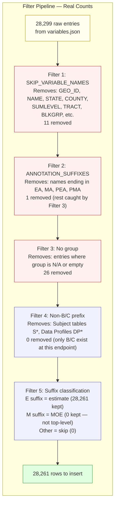
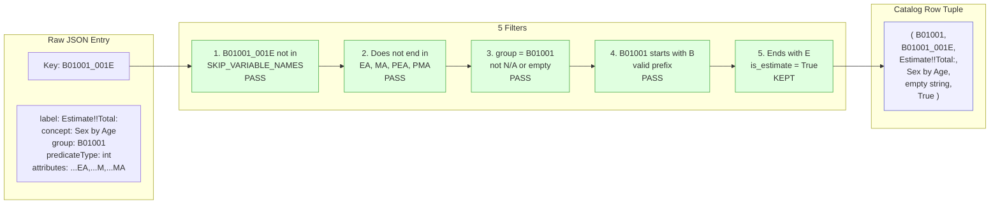
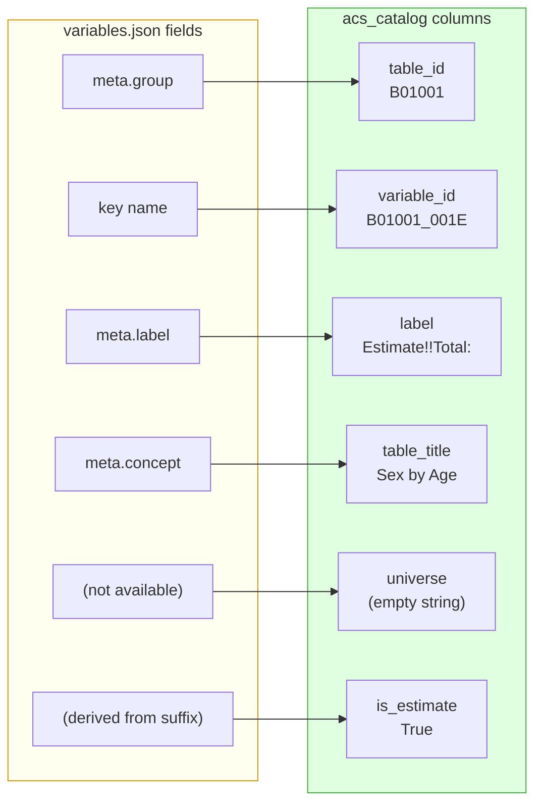
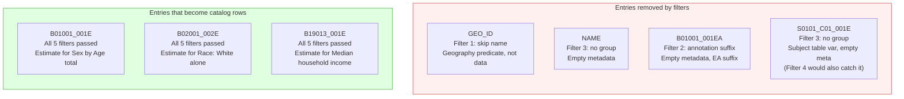
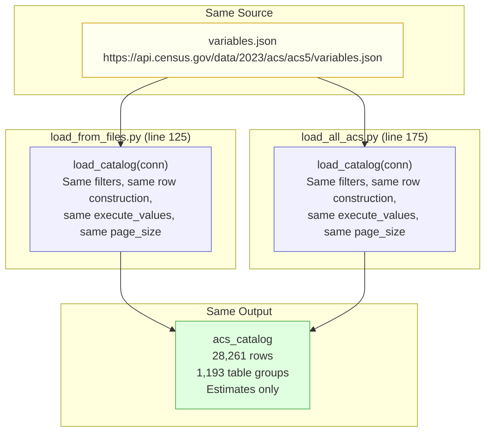

# ETL Code Path: How `variables.json` Becomes `acs_catalog`

This document traces the exact code path that populates the `acs_catalog` table. Both loaders (`load_from_files.py` line 125 and `load_all_acs.py` line 175) run identical logic — the catalog is loader-independent.

## 1. Entry: Idempotency Guard

```python
def load_catalog(conn):
    if table_has_rows(conn, "acs_catalog"):
        log.info("acs_catalog already populated — skipping.")
        return
```

Checks if the table already has data. If yes, exits immediately. This makes the ETL re-runnable without duplicating rows.

## 2. Fetch: Download variables.json

```python
resp = requests.get(VARIABLES_JSON_URL, timeout=120)
data = resp.json()
variables = data.get("variables", {})
```

Downloads `https://api.census.gov/data/2023/acs/acs5/variables.json` — ~30 MB, no API key needed. The response is a single JSON object with one key:

```json
{ "variables": { "GEO_ID": {...}, "NAME": {...}, "B01001_001E": {...}, ... } }
```

**28,299 raw entries** land in `variables`. These are everything the Census API publishes — geography fields, annotations, metadata, plus the actual data variables.

## 3. The Filter Pipeline

The loop iterates all 28,299 entries and applies 5 sequential filters. Each entry is either skipped or kept.



### Filter counts verified against live Census API

| Filter | Check | Removed | Remaining |
|---|---|---|---|
| Start | — | — | 28,299 |
| 1. Skip names | `var_name in SKIP_VARIABLE_NAMES` | 11 | 28,288 |
| 2. Skip annotations | `endswith(EA/MA/PEA/PMA)` | 1 | 28,287 |
| 3. Skip no-group | `group == "N/A" or not group` | 26 | 28,261 |
| 4. Skip non-B/C | `not group.startswith(B/C)` | 0 | 28,261 |
| 5. Suffix classify | E=kept, M=kept, other=skip | 0 | **28,261** |

## 4. What Each Filter Catches — Real Examples

### Filter 1: Geography and metadata fields

The constant `SKIP_VARIABLE_NAMES` contains:

```python
{"for", "in", "ucgid", "GEO_ID", "NAME", "GEOCOMP",
 "SUMLEVEL", "STATE", "COUNTY", "PLACE", "TRACT", "BLKGRP"}
```

Example entry killed here — `GEO_ID`:

```json
{
  "label": "Geography",
  "concept": "Sex by Age;Sex by Age (White Alone);...",
  "predicateType": "string",
  "group": "B18104,B17015,...",
  "attributes": "NAME"
}
```

This is a geography predicate, not a data variable. `"GEO_ID"` matches the skip set — removed.

### Filter 2: Annotation suffixes

The constant `ANNOTATION_SUFFIXES` contains `("EA", "MA", "PEA", "PMA")`.

Example entry killed here — `B01001_001EA`:

```json
{}
```

Empty metadata. The `EA` suffix marks it as an annotation for `B01001_001E`. Most annotation variables have empty `{}` meta and would also be caught by Filter 3, but this filter catches them first by name pattern.

### Filter 3: No-group variables

Example entry killed here — `NAME`:

```json
{}
```

Empty metadata, no `group` field. These are structural API fields with no data content.

### Filter 4: Non-B/C prefix (0 hits in practice)

Would catch Subject tables (`S0101_C01_001E`), Data Profiles (`DP02_0001E`), Comparison Profiles (`CP02_0001E`). In the 2023 ACS 5-Year `variables.json` endpoint, only B and C variables appear as top-level entries — so this filter removes 0.

The constant `VALID_TABLE_PREFIXES` contains `("B", "C")`.

### Filter 5: Suffix classification

```python
if var_name.endswith("E"):
    is_estimate = True      # 28,261 matches
elif var_name.endswith("M"):
    is_estimate = False     # 0 matches (MOE not top-level)
else:
    continue                # 0 caught
```

MOE variables like `B01001_001M` are referenced in the `attributes` field of estimate variables but do not exist as top-level keys in `variables.json`. The `endswith("M")` branch correctly yields 0 matches.

## 5. A Real Entry Through the Full Pipeline

`B01001_001E` — raw JSON from Census API:

```json
{
  "label": "Estimate!!Total:",
  "concept": "Sex by Age",
  "predicateType": "int",
  "group": "B01001",
  "limit": 0,
  "attributes": "B01001_001EA,B01001_001M,B01001_001MA"
}
```



## 6. Row Construction

Each surviving variable becomes a 6-tuple mapped from the JSON fields:

```python
rows.append((
    group,        # table_id    → "B01001"
    var_name,     # variable_id → "B01001_001E"
    label,        # label       → "Estimate!!Total:"
    concept,      # table_title → "Sex by Age"
    "",           # universe    → "" (not in variables.json per-variable)
    is_estimate,  # is_estimate → True
))
```



The `universe` field is always empty string because `variables.json` does not provide universe per-variable — it is a table-level property from the separate `groups.json` endpoint that was never integrated.

## 7. Bulk Insert

```python
execute_values(
    cur,
    """INSERT INTO acs_catalog (table_id, variable_id, label, table_title,
           universe, is_estimate)
       VALUES %s
       ON CONFLICT (variable_id) DO NOTHING""",
    rows,
    page_size=5000,
)
conn.commit()
```

- `psycopg2.extras.execute_values` — bulk insert, 5,000 rows per batch
- `ON CONFLICT (variable_id) DO NOTHING` — idempotent, skip duplicates silently
- 28,261 rows across ~6 batches
- Single `commit()` at the end — all-or-nothing

## 8. Entries That Don't Survive — Comparison



## 9. Both Loaders Produce Identical Output



The only difference between loaders is what happens AFTER catalog population — `load_from_files.py` reads local `.dat` bulk files while `load_all_acs.py` calls the Census API per table. The catalog step is identical.
